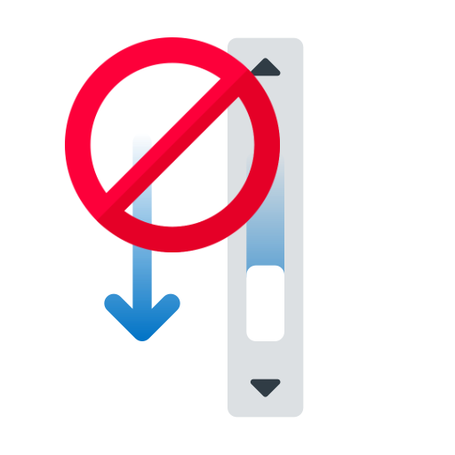

<!--
*** Thanks for using Document My Project. (https://github.com/luisvent/document_my_project) 
*** If you have a suggestion that would make this better, please fork  
*** the repo and create a pull request or simply open an issue.
*** Don't forget to give the project a star!
-->

# Minimap Scoller

Use a scrollable mini map instead of your old scrollbar!

<h4><a href="#about-the-project">About the Project</a> • <a href="#showcase">Showcase</a> • <a href="#features">Features</a> • <a href="#acknowledgements">Acknowledgements</a> • <a href="#license">License</a></h4>

<!-- TABLE_CONTENT_PLACEHOLDER -->

## About the Project

Minimap Scroller is a simplified rendering of the web page, placed on the right side of your browser tab.

Easier to use, it allows you to see where you are on the page, and even to scroll instantly to a specific point.

## Showcase

 

<table>
<tr>
<td></td>
<td></td>
</tr>
</table>

## Features

1. **Fast**

Minimap Scroller uses an optimized render of the webpage, without images or heavy elements.

2. **Agile**

The rendering is automatically updated when important elements change on the web page.

3. **Minimized**

Thanks to the strip, open the mini map only when you need it.

## Acknowledgements

- [Chrome Store](https://chromewebstore.google.com/detail/minimap-scroller/gchpemfjngonblllebgljnaaboembklm) - Download now!

## License

This project is licensed under the [MIT License](https://opensource.org/licenses/MIT).
